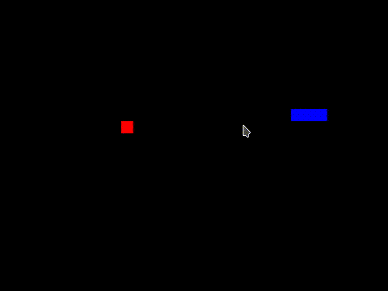

# A demo Snake game written in Bogue

## Why Bogue?

[Bogue](http://sanette.github.io/bogue/Principles.html) is a GUI
library for the ocaml language, not a game engine... But, well, why
not?

In his blog, Florent Monnier nicely demonstrates how to write a simple
Snake game in ocaml syntax and compile it to javascript with rescript,
see http://decapode314.free.fr/re/tut/ocaml-re-tut.html

Reading this, I wondered: well, Bogue can draw graphics, it has an
event loop, so that should work!

## First version: use Sdl_area

It turned out to be completely straightforward to adapt the rescript
code to Bogue, using the
[Sdl_area](http://sanette.github.io/bogue/Bogue.Sdl_area.html) widget
everywhere Javascript graphics were required.

Here is an analysis of the differences.

### Graphics initialization

#### Rescript code
```ocaml
let canvas = Canvas.getElementById Canvas.document "my_canvas"
let ctx = Canvas.getContext canvas "2d"
```

#### Bogue code
```ocaml
let widget = W.sdl_area ~w:width ~h:height ()
let area = W.get_sdl_area widget
```
Here (above code) we create a Widget contaning an Sdl_area, and extract the
Sdl_area object itself for further direct access.

#### Rescript code
```ocaml
let fill_rect color (x, y) =
  Canvas.fillStyle ctx color;
  Canvas.fillRect ctx x y 20 20
```

#### Bogue code
```ocaml
let fill_rect color (x, y) =
  let open Sdl_area in
  let x, y = to_pixels (x, y) in
  let w, h = to_pixels (20, 20) in
  fill_rectangle area ~color ~w ~h (x, y)
```
Bogue mainly works with "logical pixels" coordinates, which are then
scaled taking into account the user's screen size (similar to
javascript/CSS in a browser). However, the Sdl_area widget is special:
it was purposedly designed to access real hardware pixels. This is why
we have to use here the `to_pixels` utility.

### The `display_game` function
It is now easy to understand the changed made to this function, except
for this tiny bit:

```ocaml
Sdl_area.update area
```

Indeed, for performance reasons, Bogue only updates widgets that are
visually modified. In the case of Sdl_areas, one has to explicitely
indicate whether the content should be refreshed onscreen or not.

### The game logic
We kept exactly the same code!  (except for a small bug correction for
detecting `game_over`).

### Keyboard events
Bogue general strategy for treating events is to connect two widgets
(source and target): each connection listens to a specific type of
event, and execute a specific action. In this case, we have only one
widget (the Sdl_area), but that's not a problem: we can connect it to
itself!

#### Rescript code
```ocaml
let keychange_event ev =
    req_dir :=
      match ev.Canvas.keyCode with
      | 37 -> `left
      | 38 -> `up
      | 39 -> `right
      | 40 -> `down
      | _ -> (!state.dir_snake)
```

#### Bogue code
```ocaml
 let keychange_action _area _none ev =
    req_dir :=
      match E.(get ev keyboard_keycode) with
      | x when x = Sdl.K.left -> `left
      | x when x = Sdl.K.up -> `up
      | x when x = Sdl.K.right -> `right
      | x when x = Sdl.K.down -> `down
      | _ -> (!state.dir_snake)
```

A general Bogue action takes 3 arguments: source widget, target widget,
and event. Here the source and the target are the same (the Sdl_area),
but we don't even use them in the code of this function, that's why we
used dummy names `_area` and `_none`.

### Game loop (animation)
This games runs at a constant rate (here 7 frames per seconds). So we
need a way to regularly update the game state, and graphics, while
listening to keystrokes.

#### Rescript code

```ocaml
  let animate () =
    state := update_state !req_dir !state;
    display_game !state;
    ()
  in

  Canvas.addKeyEventListener Canvas.window "keydown" keychange_event true;

  let _ = Canvas.setInterval animate (1000/7) in
  ()
```

which requires:

```ocaml
type key_event = {
  keyCode: int,
  key: string,
}

@send external addKeyEventListener: (Dom.element, string, key_event => unit, bool) => unit = "addEventListener"

type intervalID

@val external setInterval: (unit => unit, int) => intervalID = "setInterval"
```

#### Bogue code
```ocaml
  let rec animate () =
    state := update_state !req_dir !state;
    display_game !state;
    Update.push widget;
    Timeout.add (1000/7) animate |> ignore

  in

  let c = W.connect_main widget widget keychange_action E.[key_down] in
  let layout = L.resident widget in
  let board = Bogue.of_layout ~connections:[c] layout in

  animate ();
  Bogue.run board
```

Bogue has several ways to execute actions regularly. Here we use the
[Timeout](http://sanette.github.io/bogue/Bogue.Timeout.html) mechanism
in a recursive way.

You can then see how we register the `keychange_action` to be executed
when the `key_down` event is caught.

Finally we define the complete `layout` of our program (which consists
here of the sole Sdl_area `widget`), create a Bogue `board` with this,
and `run`!

## Second version: build the snake with widgets!

In the first version, all graphics are delegated to the Sdl_area: this
is very simple to understand, but somehow ignores interesting
graphical features provided by other Bogue widgets.

In this new version, we abandon the Sdl_area and build the snake as a
list of Image widgets. Although this might seem more involved, it is
certainly closer to Bogue spirit. This enables interesting features
like animating each snake segment using Bogue internal animation
mechanism. (This will be developped in another project).

The final layout is a superposition of 3 layouts:

```ocaml
 let area = L.superpose [screen; snake; fruit] in
```

The `screen` contains a unique widget (this is called a `resident` in
Bogue terminology) which is a Box. It is used for displaying the
background and listening to keystrokes.

The `snake` layout, like `screen`, has the size of the whole area. It
is initially empty and is filled at each game iteration by the list of
all snake segments (or "cells"). Each cell itself is a Layout
containing a Box widget. In further versions, it will be easy to
replace this box by an image widget.

The `fruit` layout just contains a small box widget, whose position is
updated when necessary.

## Play the game

With the rescript version, you need to write a piece of HTML to host
the javascript and run in a browser.

With Bogue, you compile the code once, as a usual ocaml program, which
gives you a desktop application that you can run later.

```
dune exec ./snake1.exe
```

Note that, in the Bogue version, you first need to click inside the
window to give it the focus, so that keystrokes are properly detected.

If you see a small gap between the snake segments (boxes) it's because
Bogue detected a non-integer scaling for your screen DPI. You can
force integer scaling by setting the variable `INT_SCALE` in your
`bogue.conf` file, or directly on the command line like this:

```
BOGUE_INT_SCALE=true dune exec ./snake1.exe
```


